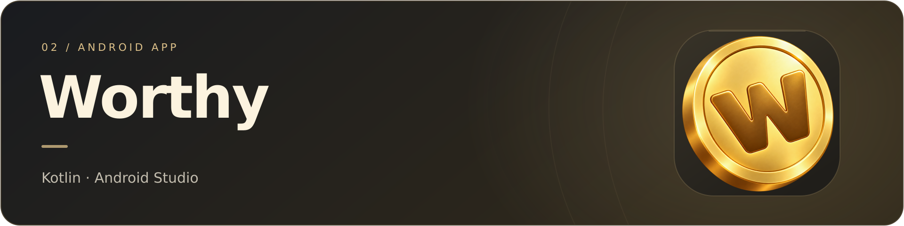

<!-- Perfil GitHub de LogicGrove. Subir también README.en.md y assets.
Se utiliza HTML sencillo de forma consistente para conservar bloques y espacios.
Las portadas son ilustraciones decorativas, no capturas de aplicaciones.
-->

 

<a href="https://github.com/LogicGrove/LogicGrove/blob/main/README.md">Español</a> &nbsp; / &nbsp; <b>English</b>

<a href="#jade">Jade</a> &nbsp;·&nbsp; <a href="#worthy">Worthy</a> &nbsp;·&nbsp; <a href="#games">Games</a> &nbsp;·&nbsp; <a href="#tools">Tools</a>

 

I build projects to understand how things work. AI, apps, games and ideas that sometimes go beyond the screen.

Imagine &nbsp;→&nbsp; Build &nbsp;→&nbsp; Test &nbsp;→&nbsp; Improve

 
 

 

<h2 id="jade">01 · Jade</h2>

CHESS AND ARTIFICIAL INTELLIGENCE

 

 

A chess opponent exploring more human-like play. I combine <b>Stockfish</b>, real games from <b>Lichess</b> and a <b>compact neural network</b> to study how people choose their moves.

<code>Python</code> &nbsp; <code>PyTorch</code> &nbsp; <code>Stockfish</code> &nbsp; <code>Colab</code>

Includes training, an interactive board and PGN analysis. Playing profiles are experimental, not certified Elo ratings.

<!-- IMAGEN PROPIA: sube assets/jade-captura.png y activa esta línea.

-->
<!-- El banner de Jade enlaza al repositorio. -->

 
 

 

<h2 id="worthy">02 · Worthy</h2>

MY ANDROID WORKBENCH

 

 

An app of my own where I learn about screens, code structure and user experience. I want each feature to be understandable and comfortable to use.

<code>Kotlin</code> &nbsp; <code>Android Studio</code>

A project in development. Learning one screen and one feature at a time.

<!-- IMAGEN PROPIA: sube assets/worthy-captura.png y activa esta línea.

-->
<!-- ENLACE AL REPOSITORIO: añade aquí la URL real cuando esté publicado. -->

 
 

 

<h2 id="games">03 · Games and prototypes</h2>

IDEAS YOU CAN PLAY

 

 

I experiment with maps, animations, interfaces and mechanics in <b>Roblox Studio</b>. I explore how controls, movement and environments change the experience of playing.

<code>Roblox Studio</code> &nbsp; <code>Luau</code>

A space for small experiments and discovering which ideas are worth developing.

<!-- IMAGEN PROPIA: sube assets/juegos-captura.png y activa esta línea.

-->
<!-- ENLACE AL REPOSITORIO: añade aquí la URL real cuando esté publicado. -->

 
 

 

<h2 id="tools">My toolbox</h2>
 

<b>Code and data</b>

<code>Python</code> &nbsp; <code>Kotlin</code> &nbsp; <code>Luau</code> &nbsp; <code>NumPy</code> &nbsp; <code>SQLite</code> &nbsp; <code>Parquet</code>

 

<b>Beyond code</b>

PCs &nbsp;·&nbsp; 3D printing &nbsp;·&nbsp; Audio &nbsp;·&nbsp; Privacy

 
 

 

<h2>Learning as I build</h2>
 

Try something small, understand why it works and improve with what I discover. I use AI tools to research and write code, checking their suggestions and learning from mistakes.

 

Always working on something. 🌱

