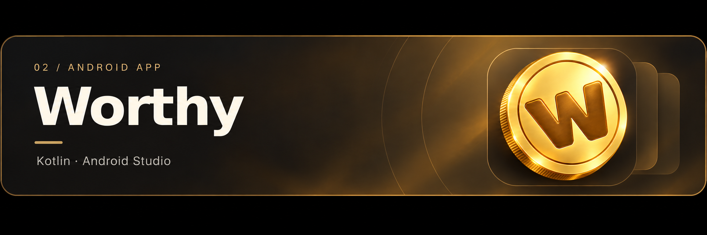

<!-- LogicGrove GitHub profile. Upload README.md and assets as well.
Simple HTML is used consistently to preserve blocks and spacing.
The banners are decorative illustrations, not application screenshots.
-->

 

<a href="https://github.com/LogicGrove/LogicGrove/blob/main/README.md">Español</a> &nbsp; / &nbsp; <b>English</b>

<a href="#01--jade">Jade</a> &nbsp;·&nbsp; <a href="#02--worthy">Worthy</a> &nbsp;·&nbsp; <a href="#03--games-and-prototypes">Games</a> &nbsp;·&nbsp; <a href="#my-toolbox">Tools</a>

 

I build projects to understand how things work. AI, apps, games and ideas that sometimes go beyond the screen.

Imagine &nbsp;→&nbsp; Build &nbsp;→&nbsp; Test &nbsp;→&nbsp; Improve

 
 

 

<h2 id="jade">01 · Jade</h2>

CHESS AND ARTIFICIAL INTELLIGENCE

 

 

A chess opponent exploring more human-like play. I combine <b>Stockfish</b>, real games from <b>Lichess</b> and a <b>compact neural network</b> to study how people choose their moves.

<code>Python</code> &nbsp; <code>PyTorch</code> &nbsp; <code>Stockfish</code> &nbsp; <code>Colab</code>

Includes training, an interactive board and PGN analysis. Playing profiles are experimental, not certified Elo ratings.

<!-- YOUR SCREENSHOT: upload assets/jade-captura.png and enable this line.

-->
<!-- The Jade banner links to its repository. -->

 
 

 

<h2 id="worthy">02 · Worthy</h2>

SAVE FOR THE THINGS YOU WANT

 

 

An Android app that turns the things you want to buy into savings goals. Add a product, record contributions, and see how much remains until you reach your target.

<code>Kotlin</code> &nbsp; <code>Jetpack Compose</code> &nbsp; <code>Material 3</code> &nbsp; <code>Room</code>

Goals in a deck of cards, personalization, and data stored on your device. <a href="https://github.com/LogicGrove/worthy-android/releases/tag/v1.0">Download Worthy 1.0</a>.

 
 

 

<h2 id="games">03 · Games and prototypes</h2>

IDEAS YOU CAN PLAY

 

 

I experiment with maps, animations, interfaces and mechanics in <b>Roblox Studio</b>. I explore how controls, movement and environments change the experience of playing.

<code>Roblox Studio</code> &nbsp; <code>Luau</code>

A space for small experiments and discovering which ideas are worth developing.

<!-- YOUR SCREENSHOT: upload assets/juegos-captura.png and enable this line.

-->
<!-- REPOSITORY LINK: add the actual URL here once published. -->

 
 

 

<h2 id="tools">My toolbox</h2>
 

<b>Code and data</b>

<code>Python</code> &nbsp; <code>Kotlin</code> &nbsp; <code>Luau</code> &nbsp; <code>NumPy</code> &nbsp; <code>SQLite</code> &nbsp; <code>Parquet</code>

 

<b>Beyond code</b>

PCs &nbsp;·&nbsp; 3D printing &nbsp;·&nbsp; Audio &nbsp;·&nbsp; Privacy

 
 

 

<h2>Learning as I build</h2>
 

Try something small, understand why it works and improve with what I discover. I use AI tools to research and write code, checking their suggestions and learning from mistakes.

 

Always working on something. 🌱

