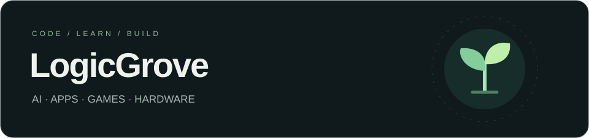
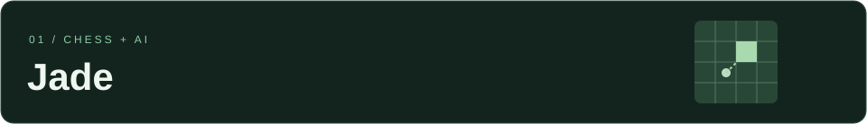

<!-- Perfil GitHub de LogicGrove. Subir también README.en.md y assets.
Se utiliza HTML sencillo de forma consistente para conservar bloques y espacios.
Las portadas son ilustraciones decorativas, no capturas de aplicaciones.
-->

 

<b>Español</b> &nbsp; / &nbsp; <a href="https://github.com/LogicGrove/LogicGrove/blob/main/README.en.md">English</a>

<a href="#jade">Jade</a> &nbsp;·&nbsp; <a href="#worthy">Worthy</a> &nbsp;·&nbsp; <a href="#juegos">Juegos</a> &nbsp;·&nbsp; <a href="#herramientas">Herramientas</a>

 

Construyo proyectos para entender cómo funcionan las cosas. IA, aplicaciones, juegos y alguna idea que acaba fuera de la pantalla.

Imaginar &nbsp;→&nbsp; Construir &nbsp;→&nbsp; Probar &nbsp;→&nbsp; Mejorar

 
 

 

<h2 id="jade">01 · Jade</h2>

AJEDREZ E INTELIGENCIA ARTIFICIAL

 

 

Un rival de ajedrez que busca jugar de forma más humana. Combino <b>Stockfish</b>, partidas reales de <b>Lichess</b> y una <b>red neuronal compacta</b> para explorar cómo elegimos nuestros movimientos.

<code>Python</code> &nbsp; <code>PyTorch</code> &nbsp; <code>Stockfish</code> &nbsp; <code>Colab</code>

Incluye entrenamiento, tablero interactivo y análisis PGN. Los perfiles de juego son experimentales, no ELO certificados.

<!-- IMAGEN PROPIA: sube assets/jade-captura.png y activa esta línea.

-->
<!-- ENLACE AL REPOSITORIO: añade aquí la URL real cuando esté publicado. -->

 
 

 

<h2 id="worthy">02 · Worthy</h2>

MI LABORATORIO ANDROID

 

 

Una aplicación propia con la que aprendo a diseñar pantallas, organizar el código y cuidar la experiencia de uso. Me interesa que cada función se entienda y sea cómoda de utilizar.

<code>Kotlin</code> &nbsp; <code>Android Studio</code>

Proyecto en desarrollo. Aprendiendo una pantalla y una función cada vez.

<!-- IMAGEN PROPIA: sube assets/worthy-captura.png y activa esta línea.

-->
<!-- ENLACE AL REPOSITORIO: añade aquí la URL real cuando esté publicado. -->

 
 

 

<h2 id="juegos">03 · Juegos y prototipos</h2>

IDEAS QUE SE PUEDEN JUGAR

 

 

Experimento con mapas, animaciones, interfaces y mecánicas en <b>Roblox Studio</b>. Pruebo cómo cambia una partida al ajustar los controles, el movimiento o el entorno.

<code>Roblox Studio</code> &nbsp; <code>Luau</code>

Un espacio para probar ideas pequeñas y ver cuáles merece la pena desarrollar.

<!-- IMAGEN PROPIA: sube assets/juegos-captura.png y activa esta línea.

-->
<!-- ENLACE AL REPOSITORIO: añade aquí la URL real cuando esté publicado. -->

 
 

 

<h2 id="herramientas">Mi caja de herramientas</h2>
 

<b>Código y datos</b>

<code>Python</code> &nbsp; <code>Kotlin</code> &nbsp; <code>Luau</code> &nbsp; <code>NumPy</code> &nbsp; <code>SQLite</code> &nbsp; <code>Parquet</code>

 

<b>También fuera del código</b>

PCs &nbsp;·&nbsp; Impresión 3D &nbsp;·&nbsp; Audio &nbsp;·&nbsp; Privacidad

 
 

 

<h2>Aprender mientras lo construyo</h2>
 

Probar algo pequeño, entender por qué funciona y mejorar con lo que descubro. Uso herramientas de IA para investigar y programar, comprobando sus propuestas y aprendiendo de los fallos.

 

Siempre con algo entre manos. 🌱

